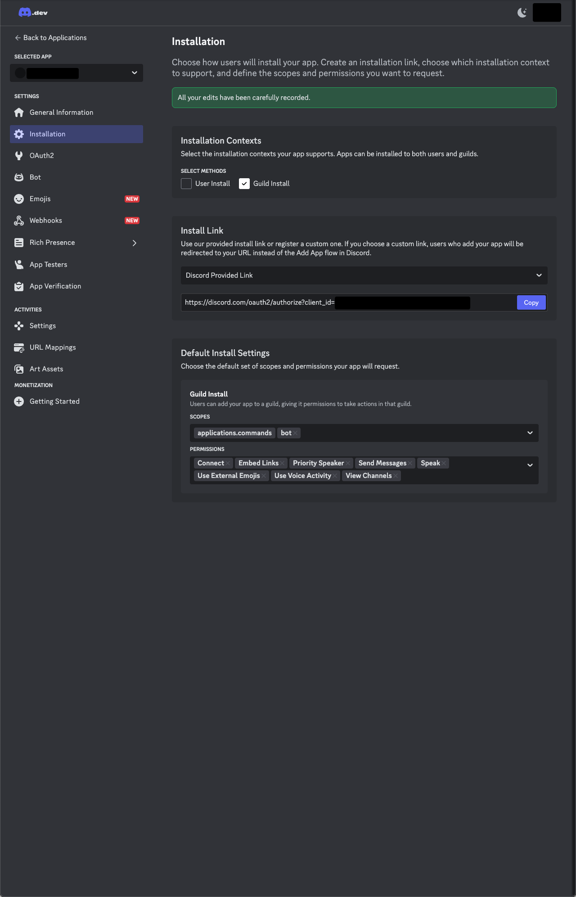

# Reproduction

This repo is meant to act as an attempt to illustrate how to setup nostrum to create a bot that supports joining and playing audio in a voice channel:

- Copy example.envrc to .envrc
- Update the .envrc values to match the values found in your Bot's Settings > General information tab
- Go to Settings > Installation and set up your bot to have the following permissions
  
- Use the Install Link provided by discord to install your bot on a test server
- Start the bot using `iex -S mix phx.server`
- Ensure the following message is displayed in the iex session

```elixir
[info] Creating guild commands for guild <some guild id>
```

- Go to a voice channel
- In a chat type `/summon`
- Once the bot has joined type `/play example`
- Nothing is currently playing right now

```elixir
iex(3)> [lib/app/nostrum/consumer.ex:177: App.Nostrum.Consumer.do_command/1]
:code.priv_dir(:app) #=> ~c"/Users/virtu/projects/virtu/sound_board/app/_build/dev/lib/app/priv
"
|> Path.join("audio/music-too-loud.mp3") #=> "/Users/virtu/projects/virtu/sound_board/app/_buil
d/dev/lib/app/priv/audio/music-too-loud.mp3"

[info] Handling interaction: "play"
[info] Handling play command for guild REDACTED_GUILD_ID
[info] Checking voice readiness for guild REDACTED_GUILD_ID
[info] Voice is ready for guild REDACTED_GUILD_ID
[info] Attempting to play file: /Users/virtu/projects/virtu/sound_board/app/_build/dev/lib/app/
priv/audio/music-too-loud.mp3
[info] File exists with size: 32705
[info] Play command result: :ok
[debug] VOICE SPEAKING UPDATE %Nostrum.Struct.Event.SpeakingUpdate{channel_id: 1305601420103385179, guild
_id: REDACTED_GUILD_ID, speaking: true, current_url: "/Users/virtu/projects/virtu/sound_board
/app/_build/dev/lib/app/priv/audio/music-too-loud.mp3", timed_out: false}
[debug] VOICE HEARTBEAT_ACK
[debug] VOICE SPEAKING UPDATE %Nostrum.Struct.Event.SpeakingUpdate{channel_id: 1305601420103385179, guild
_id: REDACTED_GUILD_ID, speaking: false, current_url: "/Users/virtu/projects/virtu/sound_boar
d/app/_build/dev/lib/app/priv/audio/music-too-loud.mp3", timed_out: true}
```

# App

To start your Phoenix server:

- Run `mix setup` to install and setup dependencies
- Start Phoenix endpoint with `mix phx.server` or inside IEx with `iex -S mix phx.server`

Now you can visit [`localhost:4000`](http://localhost:4000) from your browser.

Ready to run in production? Please [check our deployment guides](https://hexdocs.pm/phoenix/deployment.html).

## Learn more

- Official website: https://www.phoenixframework.org/
- Guides: https://hexdocs.pm/phoenix/overview.html
- Docs: https://hexdocs.pm/phoenix
- Forum: https://elixirforum.com/c/phoenix-forum
- Source: https://github.com/phoenixframework/phoenix
